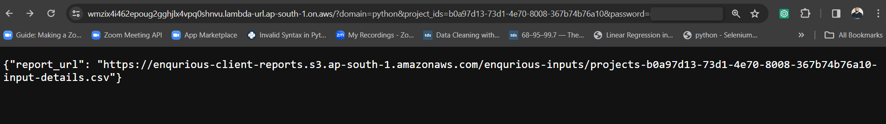

# AWS Lambda MCQ Fetcher

## 🎯 Goal
This AWS Lambda function is designed to fetch multiple-choice questions (MCQs) and checkboxes from a specified domain and project IDs. Users can provide parameters such as domain, project IDs, and a password via URL to execute the function.

## Usage

### Input Parameters

The Lambda function takes the following parameters via URL:

1. **Domain**: Specify the domain from which you want to fetch the questions. At a time, mention only a single domain, such as (Python/Excel/SQL/...)

2. **Project IDs**: Provide the project IDs of the projects from which you want to fetch the MCQs and checkboxes. Make sure to include only the project IDs of the specified domain. Do not mix project IDs from different domains. So, if you are fetching the questions of python, then mention the project_ids of python projects only, don't include project ids of any other domain project such as SQL, Excel, etc

3. **Password**: Provide the password required to access the Lambda function.

### Result

The result will be a CSV file containing all the MCQs and checkboxes of the project whose project IDs are mentioned. However, there are some exceptions in the result:

1. **Exclusion of Images in Options**: Any inputs containing images in the options will be excluded from the final result.

2. **Elimination of Inputs Without Description**: Inputs lacking descriptions will be eliminated and not considered in the final result.

3. **Elimination of Inputs With Incorrect Answers**: Inputs where the correct answer is not selected will also be eliminated and not considered in the final result.

### Example Usage

**Step 1:** Paste your url in the browser:

**Step 2:** We will get the response as shown above, now copy that **report_url** and paste it into the browser to download the file